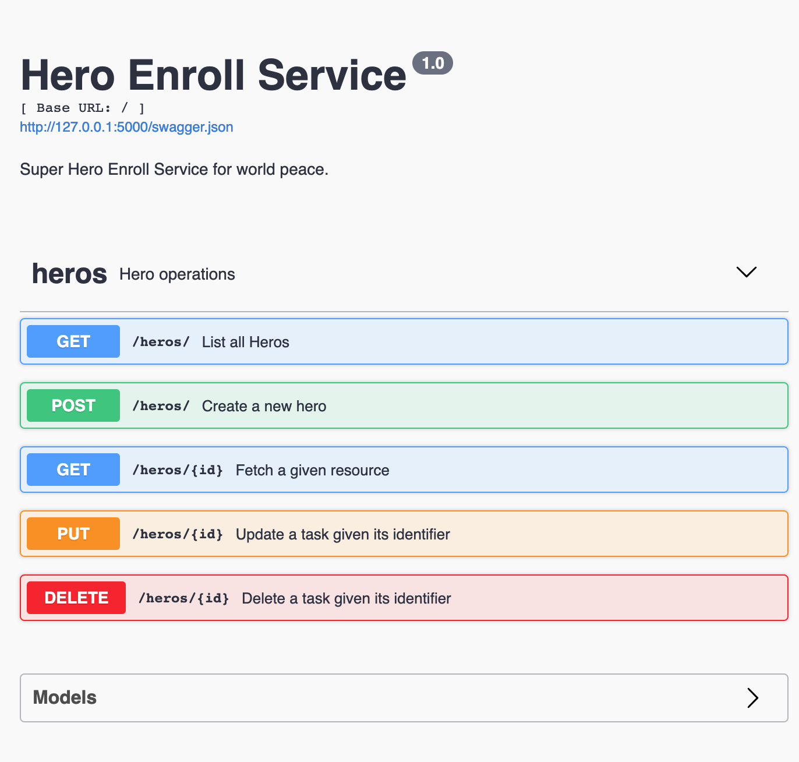

# Akademize Hero Enroll Python Flask App

This application provides APIs to make CRUD operations for
Hero Enroll Service.

This application was created in series of step by step development

1. [Crude way of creating APIs, write the data to JSON file](https://github.com/sravanrekandar/akademize-hero-enroll-python-flaskapp/tree/chapter01-json-store)
2. **Current implementation** Using DAO (Data Access Objects)
  and Restful (GET, POST, PUT and DELETE) apis.
  [Reference from Flast RestX](https://flask-restx.readthedocs.io/en/latest/example.html)

## Prerequisites

- Python >= 3.7

## Env Setup

```bash
./setup.sh
```

## Start the application

```bash
$ ./start.sh
 * Serving Flask app "app"
 * Forcing debug mode on
 * Running on http://127.0.0.1:5000/ (Press CTRL+C to quit)
 * Restarting with stat
 * Debugger is active!
 * Debugger PIN: 914-428-710
```

Navigate to [http://127.0.0.1:5000](http://127.0.0.1:5000) to view the apis in [Swagger UI](https://swagger.io/tools/swagger-ui/)



## APIs

- Create
- Retrieve
- Update
- Delete
